# CS305 Computer Networks

## Chapter 1 Computer Networks and the Internet

### Internet

Internet standards:

- **RFC**: Request for Comments

- **IETF**: Internet Engineering Task Force

### Network Edge

Access networks: cable-based access, digital subscriber line (DSL)

Wireless access networks: **WLAN**: Wireless Local Area Networks, Wide-area cellular access networks

link transmission rate, aka link capacity, aka link bandwidth

packet transmission delay = time needed to transmit L-bit packet into link = L (bits) / R(bits/sec)

### Network Core

packet-switching

    transmission delay: L/R seconds to transmit L-bit packet into link at R bps

    one-hop transmission delay: 0.1msec

packet queue and loss: packets can be dropped (lost) if memory (buffer) in router fills up

circuit switching: no sharing, commonly used in traditional telephone network

**FDM** Frequency Division Multiplexing 

**TDM** Time Division Multiplexing 

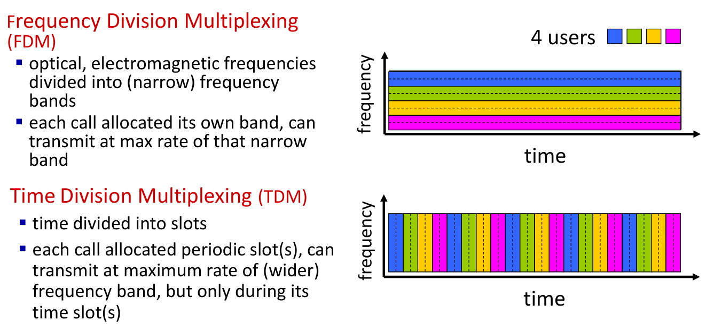

Hosts connect to Internet via access Internet Service Providers (**ISP**)

Access ISPs must be interconnected

**IXP** Internet exchange point

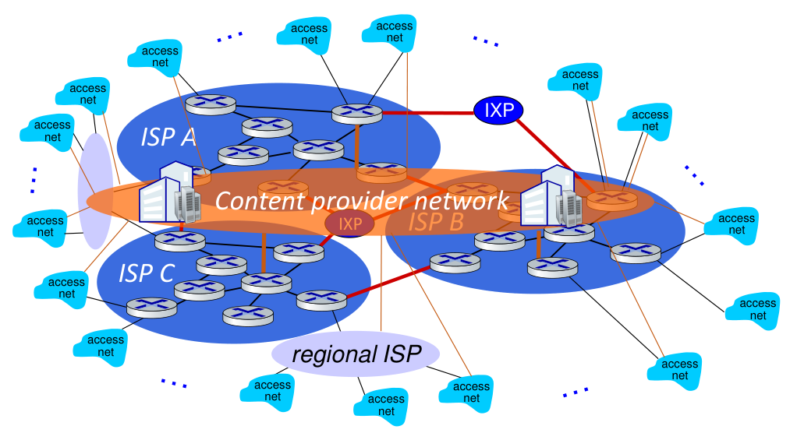

“tier-1” commercial ISPs (e.g., 移动、联通、电信), national & international coverage

content provider networks (e.g., 阿里云、腾讯云): private network that connects its data centers to Internet, often bypassing tier-1, regional ISPs

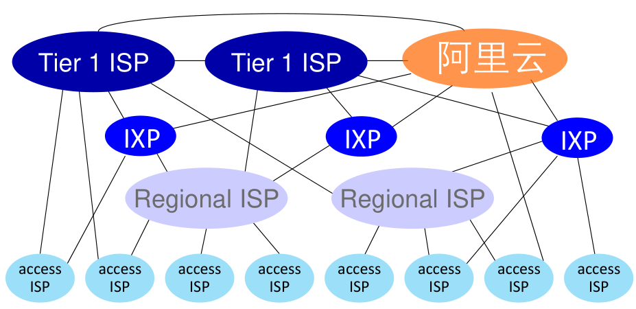

### Protocol Layers

*Internet protocol stack* 

- application: supporting network applications
  
  - IMAP, SMTP, HTTP

- transport: process-process data transfer
  
  - TCP, UDP

- network: routing of datagrams from source to destination
  
  - IP, routing protocols

- link: data transfer between neighboring network elements
  
  - Ethernet, 802.11 (WiFi), PPP

- physical: bits “on the wire”

**NIC** Network Interface Controller

Media Access Control (**MAC**) address

Each network interface has a MAC address

Internet Protocol address (IP address) 0.0.0.0 – 255.255.255.255

Subnet

Subnet mask: IP & Subnet mask = Subnet

Gateway is the router

### Delay

Packet delay dnodal = dproc + dqueue + dtrans + dprop

    dproc: nodal processing, check bit errors, determine output link, typically < msec

    dqueue: queueing delay, time waiting at output link for transmission, 

    dtrans: transmission delay, packet length (bits)/link transmission rate (bps)

    dprop: propagation delay, length of physical link/propagation speed (~2x108 m/sec)

throughput: rate (bits/time unit) at which bits are being sent from sender to receiver

### Security

packet sniffing: broadcast media, read/record all packets

IP spoofing: send packet with false source address

Denial of Service (DoS): overwhelm resource with bogus traffic

Defense: 

- authentication: proving you are who you say you are
  
  - cellular networks provides hardware identity via SIM card; no such hardware assist in traditional Internet

- confidentiality: via encryption

- integrity checks: digital signatures prevent/detect tampering

- access restrictions: password-protected VPNs

- firewalls: specialized “middleboxes” in access and core networks

## Chapter 2 Application Layer

process: program running within a host

### Web and HTTP

**URL** (Uniform Resource Locator)

**HTTP**: hypertext transfer protocol

TCP port 80 non-encrypted, port 443 secured

HTTP 1.0 non persistent, at most one object sent over TCP connection

HTTP 1.1 persistent multiple objects can be sent over single TCP connection between client and that server

RTT (definition): time for a small packet to travel from client to server and back

HTTP 1.0 reponse time = 2RTT + flie transmission time

    client: initiate connection -> request file -> file received

two types of HTTP messages: request, response

Request message

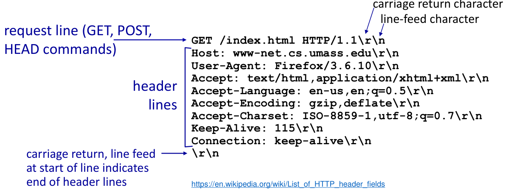

Response message

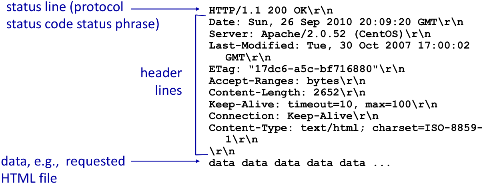

Request message: POST GET HEAD PUT

status line - header lines - data

HTTP response status codes: 200 OK, 301 Moved Permanently, 400 Bad Request, 404 Not Found, 505 HTTP Version Not Supported

cookies : maintain user/server state between transactions

Web cache delay calculation

request: If-modified-since: <date>

response: HTTP/1.0 304 Not Modified (if cached copy is up-to-date)

HTTP1.1: FCFS(first-come-first-serve), head-of-line (HOL) blocking

HTTP2: increased flexibility at server in sending objects to client, divide objects into frames, schedule frames to mitigate HOL blocking

HTTP/3: decreased delay in multi-object HTTP requests, adds security , per object error- and congestion- control (more pipelining) over UDP

### Email

simple mail transfer protocol: **SMTP** port 25

HTTP: pull SMTP: push

**IMAP**: Internet Mail Access Protocol, from server to agent port 143

### DNS

Domain Name System

Root - Top Level Domain (TLD) - Authoritative

when host makes DNS query, query is sent to its local DNS server

iterated query ; recursive query

DNS records: resource records (RR) , format (name, value, type , ttl)

type = A (name = hostname, value = IP address)

type = NS (name = domain, value = hostname of authoritative name server for this domain)

type = CNAME (name = alias, value = caconical name)

type = MX (value = name of mailserver)

DNS message

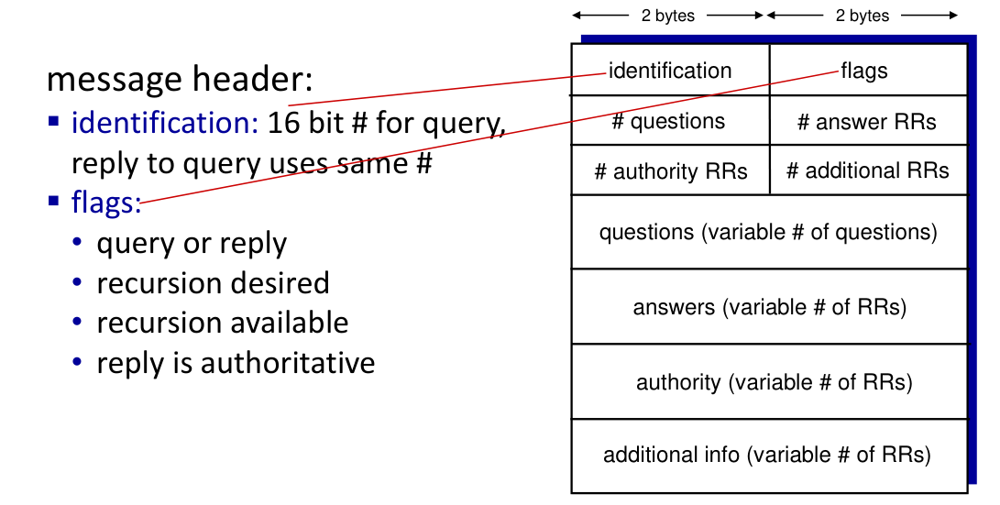

### Peer-to-peer (P2P)

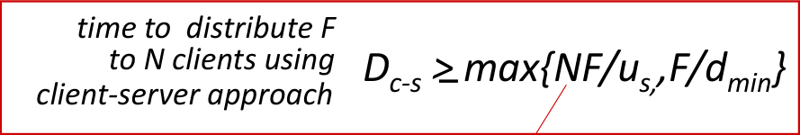

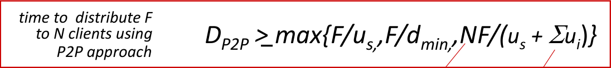

churn: peers may come and go

### Video Streaming

streaming: at this time, client playing out early part of video, while server still sending later part of video

playout buffering, playout delay

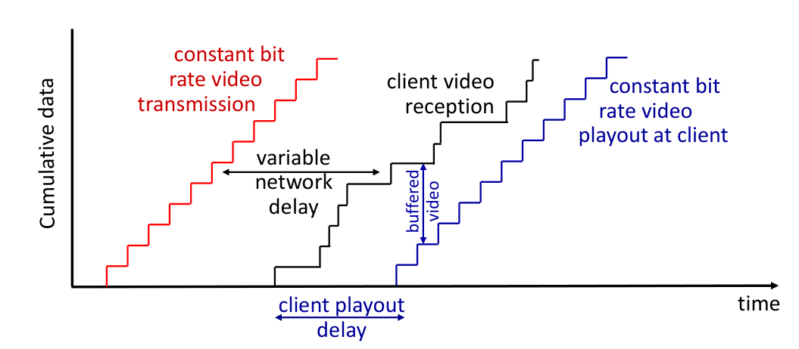

**DASH**: Dynamic, Adaptive Streaming over HTTP

server:
• divides video file into multiple chunks
• each chunk stored, encoded at different rates
• manifest file: provides URLs for different chunks

client:
• periodically measures server-to-client bandwidth
• consulting manifest, requests one chunk at a time
• chooses maximum coding rate sustainable given current bandwidth
• can choose different coding rates at different points in time (depending
on available bandwidth at time)

client determines: when to request chunk, what encoding rate to request, where to request chunk

Streaming video = encoding + DASH + playout buffering

### Content distribution networks (CDN)

enter deep: push CDN servers deep into many access networks close to uses

bring home: smaller number (10’s) of larger clusters in Points of Presence (POPs) near (but not within) access networks

**OTT**: over the top, Internet host-host communication as a service

### Socket Programming

UDP client

```python
from socket import *
serverName = 'hostname'
serverPort = 12000
clientSocket = socket(AF_INET, SOCK_DGRAM)
message = input('Input lowercase sentence:')
clientSocket.sendto(message.encode(), (serverName, serverPort))
modifiedMessage, serverAddress = clientSocket.recvfrom(2048)
print(modifiedMessage.decode())
clientSocket.close()
```

UDP server

```python
from socket import *
serverPort = 12000
serverSocket = socket(AF_INET, SOCK_DGRAM)
serverSocket.bind(('', serverPort))
print ("The server is ready to receive")
while True:
    message, clientAddress = serverSocket.recvfrom(2048)
    modifiedMessage = message.decode().upper()
    serverSocket.sendto(modifiedMessage.encode(), clientAddress)
```

TCP creates new socket for server process to communicate with that particular client

TCP provides reliable, in-order byte-stream transfer (pipe) between client and server

TCP client

```python
from socket import *
serverName = 'servername'
serverPort = 12000
clientSocket = socket(AF_INET, SOCK_STREAM)
clientSocket.connect((serverName,serverPort))
sentence = input('Input lowercase sentence:')
clientSocket.send(sentence.encode())
modifiedSentence = clientSocket.recv(1024)
print ('From Server:', modifiedSentence.decode())
clientSocket.close()
```

TCP server

```python
from socket import *
serverPort = 12000
serverSocket = socket(AF_INET,SOCK_STREAM)
serverSocket.bind(('',serverPort))
serverSocket.listen(1)
print('The server is ready to receive')
while True:
    connectionSocket, addr = serverSocket.accept()
    print(addr)
    sentence = connectionSocket.recv(1024).decode()
    capitalizedSentence = sentence.upper()
    connectionSocket.send(capitalizedSentence.encode())
    connectionSocket.close()
```

## Chapter 3 Transport Layer

**TCP**: Transmission Control Protocol

• reliable, in-order delivery
• congestion control
• flow control
• connection setup

**UDP**: User Datagram Protocol
• unreliable, unordered delivery
• no-frills extension of “best-effort” IP

multiplexing: multi application -> network

multiplexing at sender: handle data from multiple sockets, add transport header

de-multiplexing: network -> multi application

demultiplexing at receiver: use header info to deliver received segments to correct socket

UDP: demultiplexing using destination port number (only)

TCP: demultiplexing using 4-tuple: source and destination IP addresses, and port numbers

### User Datagram Protocol (UDP)

▪ no connection establishment (which can add RTT delay)
▪ simple: no connection state at sender, receiver
▪ small header size
▪ no congestion control
    ▪ UDP can blast away as fast as desired!
    ▪ can function in the face of congestion

UDP sender actions: 
▪ is passed an application-layer message
▪ determines UDP segment header fields values
▪ creates UDP segment
▪ passes segment to IP

UDP receiver actions:
▪ extracts application-layer message
▪ checks UDP checksum header value
▪ receives segment from IP
▪ demultiplexes message up to application via socket

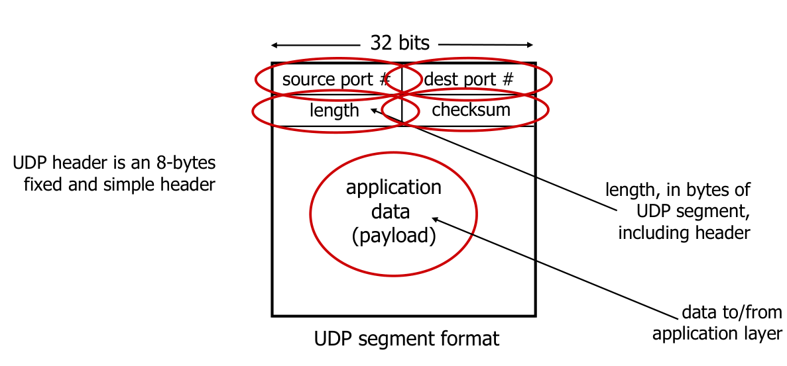

### Reliable Data Transfer

reliable data transfer (rdt)

finite state machines (FSM)

rdt1.0: reliable transfer over a reliable channel,  separate FSMs for sender, receiver

rdt2.0: channel with bit errors, acknowledgements (ACKs), negative acknowledgements (NAKs)

rdt2.1: sender, handling garbled ACK/NAKs, ACK 0 and 1

rdt2.2: a NAK-free protocol, sends ACK for last pkt received OK

rdt3.0: channels with errors and loss, waits “reasonable” amount of time for ACK

Pipelining: increased utilization

Go-Back-N

Selective repeat

### TCP

MSS: maximum segment size, typical value of MSS: 1460 bytes

Maximum transmission unit, MTU

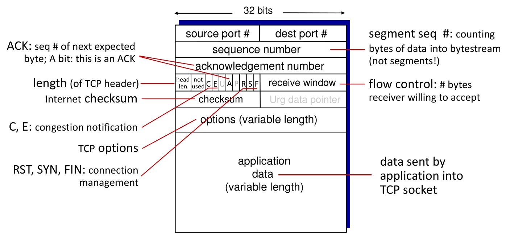

Sequence numbers: byte stream “number” of first byte in segment’s data

Acknowledgements: seq # of next byte expected from other side

exponential weighted moving average (EWMA)

EstimatedRTT(t) = (1- alpha)\*EstimatedRTT(t-1) + alpha\*SampleRTT

TimeoutInterval = EstimatedRTT + 4*DevRTT ("safety margin")

DevRTT = (1-beta)\*DevRTT + beta\*|SampleRTT-EstimatedRTT|    

TCP fast retransmit: if sender receives 3 additional ACKs for same data (“triple duplicate ACKs”), resend unACKed segment with smallest seq #

receive window : TCP receiver “advertises” free buffer space in rwnd field in TCP header, RcvBuffer size set via socket options

3-way handshake: agree to establish connection, agree on connection parameters (e.g., starting seq #s)

---

**MIDTERM**

---

### Congestion Control

Causes/costs of congestion
▪ throughput can never exceed capacity
▪ delay increases as capacity approached
▪ loss/retransmission decreases effective throughput
▪ un-needed duplicates further decreases effective throughput
▪ upstream transmission capacity / buffering wasted for packets lost downstream

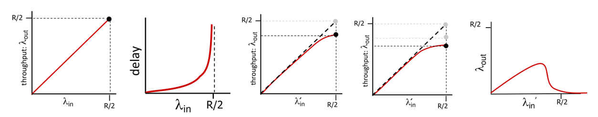

Approaches towards congestion control
▪ End-end congestion control: congestion **inferred** from observed loss, delay, **no explicit** feedback from network
▪ Network-assisted congestion control: routers provide **direct feedback** to sending/receiving hosts with flows passing through congested router, may indicate congestion level or explicitly set sending rate

### TCP Congestion Control

AIMD: senders can increase sending rate until packet loss (congestion) occurs, then decrease sending rate on loss event

Additive Increase (加性增): increase sending rate by 1
maximum segment size every RTT until loss detected

Multiplicative decrease (乘性减): sending rate is
▪ Cut in half on loss detected by triple duplicate ACK (TCP Reno)
▪ Cut to 1 MSS (maximum segment size) when loss detected by timeout (TCP Tahoe)

TCP sending roughly: send cwnd bytes, wait RTT for ACKS, then send more bytes
TCP rate $\approx \frac{\text{cwnd}}{\text{RTT}}$ bytes/sec
TCP sender limits transmission: LastByteSent- LastByteAcked $\leqslant$ cwnd

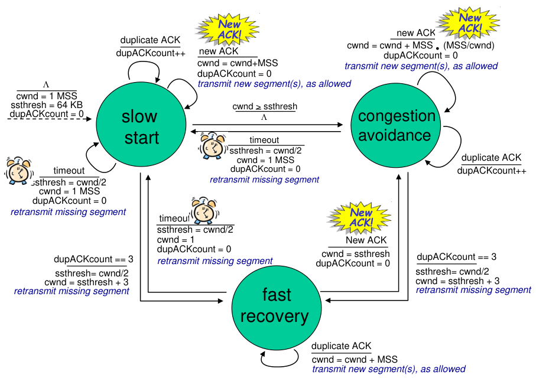

slow start
• initially cwnd = 1 MSS
• double cwnd every RTT
• done by incrementing cwnd for every ACK received

When cwnd gets to 1/2 of its value before timeout, the exponential increase switch to linear.
On loss event, ssthresh is set to 1/2 of cwnd just before loss event.

Three duplicates:
▪ TCP Reno: fast recovery from half of the cwnd
▪ TCP Tahoe: cwnd reduced to 1 MSS
Timeout:
▪ TCP Reno and Tahoe: cwnd reduced to 1 MSS

TCP Tahoe = Slow Start + Congestion Avoidance (AIMD) + Fast Retransmit
TCP Reno = TCP Tahoe + Fast Recovery

TCP CUBIC: after cutting rate/window in half on loss, initially ramp to to Wmax faster, but then approach Wmax more slowly $W(t) = C(t-K)^3 + W_{max}$

Explicit congestion notification (ECN):
▪ two bits in IP header (ToS field) marked by network router
▪ involves both IP (IP header ECN bit marking) and TCP (TCP header C,E bit marking)

UDP: send audio/video at constant rate, tolerate packet loss
TCP fair under:
▪ same RTT
▪ fixed number of sessions only in congestion avoidance

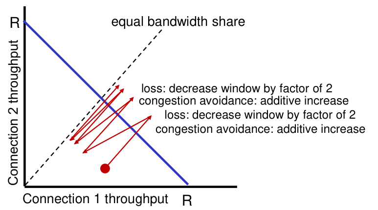

### Evolution of transport-layer functionality

QUIC: Quick UDP Internet Connections:
▪ application-layer protocol, on top of UDP
▪ streams: parallelism, no HOL blocking

TCP (reliability, congestion control state) + TLS (authentication, crypto state)
▪2 serial handshakes
QUIC: reliability, congestion control, authentication, crypto state
▪ 1 handshake

## Chapter 4 Network Layer: Data Plane

### Overview

routers:
• examines header fields in all IP datagrams passing through it
• moves datagrams from input **ports** to output **ports** to transfer datagrams along end-end path

network-layer functions:
▪ forwarding: move packets from a router’s input link to appropriate router output link
▪ routing: determine route taken by packets from source to destination

Data plane:
▪ local, per-router function
▪ determines how datagram arriving on router input **port** is forwarded **to** router output **port**

Control plane
▪ network-wide logic
▪ determines how datagram is routed **among routers** along end-end path from source host to destination host
▪ two control-plane approaches:
• traditional routing algorithms: implemented in routers
• software-defined networking (SDN): implemented in (remote) servers

best-effort service:
▪ simplicity of mechanism
▪ sufficient provisioning of bandwidth
▪ replicated, application-layer distributed services (datacenters, content distribution networks)
▪ congestion control of “elastic” services

### Router

-> physics layer (line termination, bit-level reception)
-> link layer (receive)
-> decentralized switching (lookup, forwarding, queueing)
▪ using header field values, lookup output port using forwarding table in input port memory (“match plus action”)
▪ goal: complete input port processing at ‘line speed’
▪ input port queuing: if datagrams arrive faster than forwarding rate into switch fabric
▪ destination-based forwarding: forward based only on destination IP address (traditional)
▪ generalized forwarding: forward based on any set of header field values
-> switch fabric

longest prefix matching: often performed using ternary content addressable memories (TCAMs)

switching rate: rate at which packets can be transfer from
inputs to outputs (as multiple of input/output line rate)

three major types of switching fabrics:
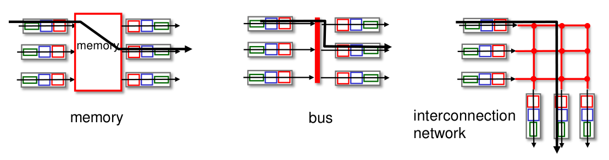

Input port queueing
If switch fabric slower than input ports combined -> queueing may occur at input queues
• queueing delay and loss due to input buffer overflow!
Head-of-the-Line (HOL) blocking: queued datagram at front of queue prevents others in queue from moving forward

Output port queueing
Buffering required when datagrams arrive from fabric faster than link transmission rate.

RFC 3439 rule of thumb: average buffering equal to “typical” RTT (say 250 msec) times link capacity C
with N flows, buffering equal to $\frac{\text{RTT}\cdot\text{C}}{\sqrt{\text{N}}}$

buffer management:
▪ drop: 
▪ marking: which packets to mark to signal congestion

packet scheduling
• first come, first served
• priority scheduling (send packet from highest priority queue that has buffered packets)
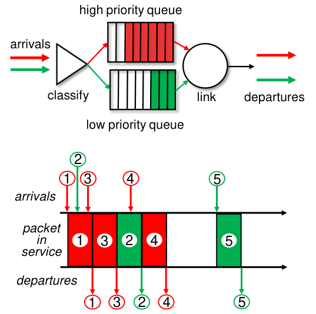
• round robin (RR) scheduling: server cyclically, repeatedly
scans class queues, sending one complete packet from each class (if available) in turn
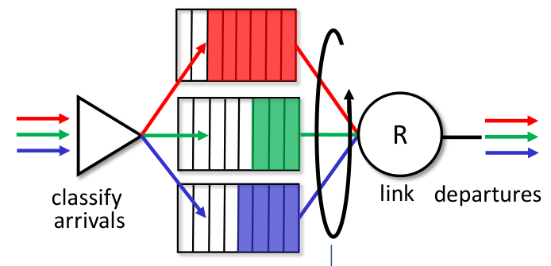
• weighted fair queueing (WFQ): each class, i, has weight, wi, and gets weighted amount of service in each cycle: $\frac{w_i}{\sum_j w_j}$
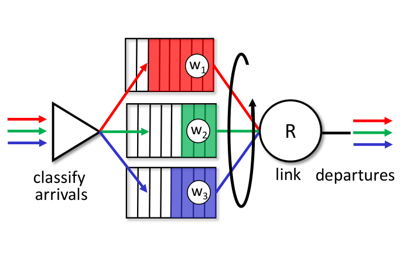

### IP (Internet Protocol)

Datagram format
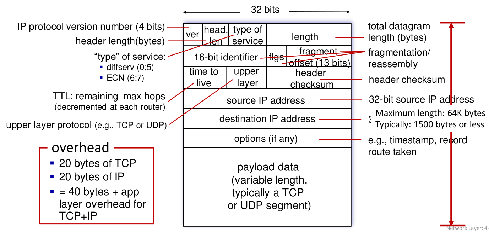

interface: connection between host/router and physical link
a subnet:
• device interfaces that can physically reach each other without passing through an intervening router
• subnet part: devices in same subnet have common high order bits
• host part: remaining low order bits

CIDR: Classless InterDomain Routing

host get IP address:
▪ hard-coded by sysadmin in config file (e.g., /etc/rc.config in UNIX)
▪ DHCP: Dynamic Host Configuration Protocol (an application-layer protocol)

client -> DHCP discover
server -> DHCP offer
client -> DHCP request
server -> DHCP ACK

NAT: network address translation
▪ outgoing datagrams: replace (source IP address, port #) of every outgoing datagram to (NAT IP address, new port #)
▪ remember (in NAT translation table) every (source IP address, port #) to (NAT IP address, new port #) translation pair
▪ incoming datagrams: replace (NAT IP address, new port #) in destination fields of every incoming datagram with corresponding (source IP address, port #) stored in NAT table

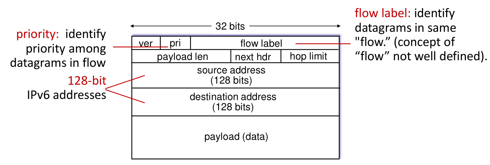
IPv6 missing
▪ no checksum (to speed processing at routers, no need to recalculate at each router)
▪ no fragmentation/reassembly
▪ no options (available as upper-layer, next-header protocol at router)

tunneling: IPv6 datagram carried as payload in IPv4 datagram among IPv4 routers

### Generalized Forwarding

each router contains a forwarding table (aka: flow table)
▪ destination-based forwarding: forward based on dest. IP address
▪ generalized forwarding: simple packet-handling rules
• many header fields can determine action
• many action possible: drop/copy/modify/log packet

## Chapter 5 Network Layer: Control Plane

Two approaches to structuring network control plane:
▪ per-router control (traditional)
▪ logically centralized control (software defined networking): Remote controller computes, installs forwarding tables in routers

### Routing Protocols

Dijkstra’s link-state routing algorithm
▪ centralized: network topology, link costs known to all nodes
▪ computes least cost paths from one node (“source”) to all other nodes
▪ iterative: after k iterations, know least cost path to k destinations

algorithm complexity: n nodes
▪ each of n iteration: need to check all nodes, w, not in N
▪ n(n+1)/2 comparisons: O(n2) complexity
▪ more efficient implementations possible: O(nlogn)

Distance vector algorithm
Based on Bellman-Ford (BF) equation (dynamic programming)
Let D_x(y): cost of least-cost path from x to y.
Then: D_x(y) = min_v { c_{x,v} + D_v(y) }

iterative, asynchronous: each local iteration caused by:
▪ local link cost change
▪ DV update message from neighbor
distributed, self-stopping: each node notifies neighbors only when its DV changes

Comparison of LS and DV algorithms
message complexity
LS: n routers, O(n^2) messages sent
DV: exchange between neighbors; convergence time varies

speed of convergence
LS: O(n^2) algorithm, O(n^2) messages
• may have oscillations
DV: convergence time varies
• may have routing loops
• count-to-infinity problem

robustness: what happens if router malfunctions, or is compromised?
LS:
• router can advertise incorrect link cost between neighbors
• each router computes only its own table
DV:
• DV router can advertise incorrect path cost (“I have a really low cost path to everywhere”): black-holing
• each router’s table used by others: error propagate thru network

### intra-ISP routing: OSPF

aggregate routers into regions known as “autonomous
systems” (AS) (a.k.a. “domains”)
intra-AS (aka “intra-domain”): routing among within same AS
inter-AS (aka “inter-domain”): routing among AS’es

most common intra-AS routing protocols:
▪ **RIP**: Routing Information Protocol [RFC 1723]
• classic DV: DVs exchanged every 30 secs
• no longer widely used
▪ **EIGRP**: Enhanced Interior Gateway Routing Protocol
• DV based
• formerly Cisco-proprietary for decades (became open in 2013 [RFC 7868])
▪ **OSPF**: Open Shortest Path First [RFC 2328]
• link-state routing
• IS-IS protocol (ISO standard, not RFC standard) essentially same as OSPF

OSPF two-level hierarchy: local area, backbone.
• link-state advertisements flooded only in area, or backbone

### inter-AS routing: BGP

BGP (Border Gateway Protocol) provides each AS a means to:
• eBGP: obtain subnet reachability information from neighboring ASes
• iBGP: propagate reachability information to all AS-internal routers.

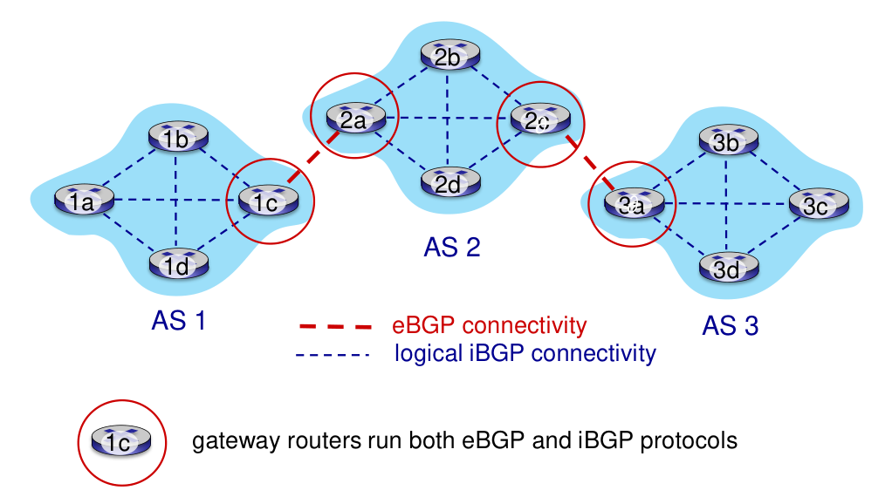

BGP advertised route: prefix + attributes
• prefix: destination being advertised
• two important attributes:
• AS-PATH: list of ASes through which prefix advertisement has passed
• NEXT-HOP: indicates specific internal-AS router to next-hop AS

hot potato routing: choose local gateway that has least intra-domain cost

### SDN control plane

Software defined networking (SDN)

Why a logically centralized control plane?
▪ easier network management
▪ table-based forwarding (recall OpenFlow API) allows “programming” routers
▪ open (non-proprietary) implementation of control plane

Data-plane switches
SDN controller (network OS)
network-control apps

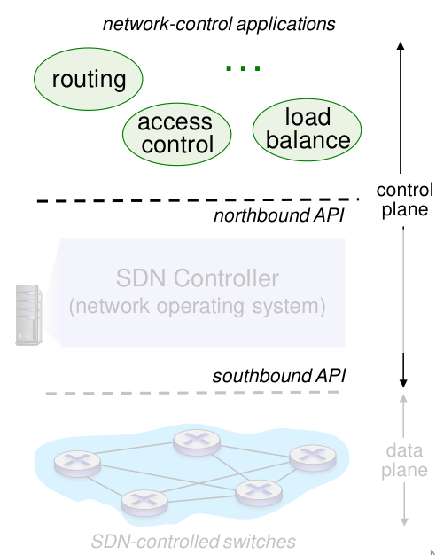

Components of SDN controller
interface layer to network control apps
network-wide state management
communication: communicate between SDN controller and controlled switches
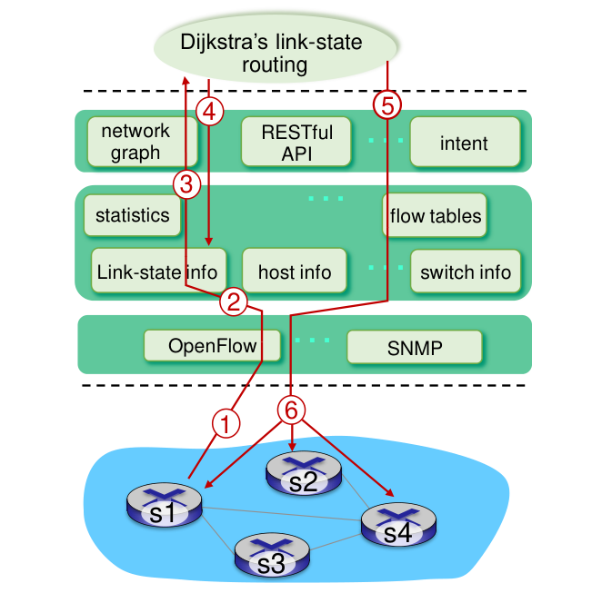

### ICMP: internet control message protocol

used by hosts and routers to communicate network-level information
• error reporting: unreachable host, network, port, protocol
• echo request/reply (used by ping)

## Chapter 6 The Link Layer and LANs

link layer has responsibility of transferring datagram from one node to physically adjacent node over a link

Link layer: services
▪ flow control:
▪ error detection:
▪ error correction:
▪ half-duplex and full-duplex:

link layer implemented in network interface card (NIC) or on a chip

sending side:
▪ encapsulates datagram in frame
▪ adds error checking bits, reliable data transfer, flow control, etc.

receiving side:
▪ looks for errors, reliable data transfer, flow control, etc.
▪ extracts datagram, passes to upper layer at receiving side

### Error detection

Parity checking
single bit parity: detect single bit errors
two-dimensional bit parity: detect and correct single bit errors

Cyclic Redundancy Check (CRC, 循环冗余检测)
▪ D: data bits (given, think of these as a binary number)
▪ G: bit pattern (generator), of r+1 bits (given)
▪ R: r bits
goal: choose r CRC bits, R, such that <D,R> = D*2^r XOR R exactly divisible by G (mod 2)
if we divide D.2r by G, want remainder R to satisfy: R = remainder [$\frac{D\cdot 2^r}{G}$]
• can detect all burst errors less than r+1 bits

### multiple access protocols
two types of “links”:
▪ point-to-point
▪ broadcast (shared wire or medium)

TDMA: time division multiple access
▪ access to channel in “rounds”
▪ each station gets fixed length slot (length = packet transmission
time) in each round
▪ unused slots go idle
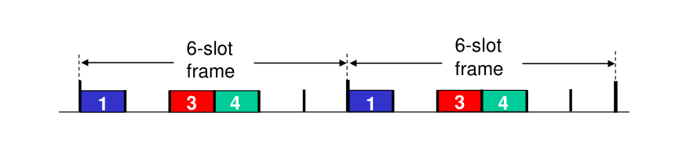

FDMA: frequency division multiple access
▪ channel spectrum divided into frequency bands
▪ each station assigned fixed frequency band
▪ unused transmission time in frequency bands go idle
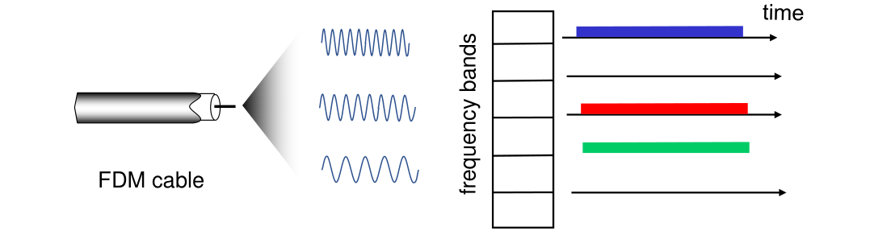

Slotted ALOHA
assumptions:
▪ all frames same size
▪ time divided into equal size slots (time to transmit 1 frame)
▪ nodes start to transmit only slot beginning
▪ nodes are synchronized
▪ if 2 or more nodes transmit in slot, all nodes detect collision
operation:
▪ when node obtains fresh frame, transmits in next slot
• if no collision: node can send new frame in next slot
• if collision: node retransmits frame in each subsequent slot with probability p until success
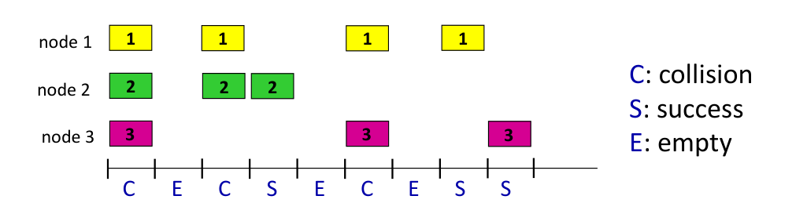

Pros:
▪ single active node can continuously transmit at full rate of channel
▪ highly decentralized: only slots in nodes need to be in sync
▪ simple
Cons:
▪ collisions, wasting slots
▪ idle slots
▪ clock synchronization

max efficiency take limit of Np*(1-p*)N-1 as N goes to infinity gives 1/e = .37

Pure ALOHA
when frame first arrives: transmit immediately
collision probability increases with no synchronization
pure Aloha efficiency: 18%

CSMA (carrier sense multiple access)
simple CSMA: listen before transmit:
• if channel sensed idle: transmit entire frame
• if channel sensed busy: defer transmission
CSMA/CD: CSMA with collision detection
• collisions detected within short time
• colliding transmissions aborted, reducing channel wastage
• collision detection easy in wired, difficult with wireless

CSMA/CD efficiency
▪ T~prop~ = max prop delay between 2 nodes in LAN
▪ t~trans~ = time to transmit max-size frame
efficiency = $\frac{1}{1+5\text{t}_\text{prop}/\text{t}_\text{trans}}$

“Taking turns” MAC protocols
polling:
▪ master node “invites” other nodes to transmit in turn
▪ Bluetooth uses polling
token passing:
▪ control token passed from one node to next sequentially.

### LANs
#### ARP
MAC (media access control) addresses
used “locally” to get frame from one interface to another physically-connected interface (same subnet, in IP-addressing sense)
48-bit MAC address (for most LANs) burned in NIC ROM, also sometimes software settable

ARP: address resolution protocol

#### Ethernet
Ethernet: “dominant” wired LAN technology:
▪ bus: all nodes in same collision domain (can collide with each other)
▪ switched: active link-layer 2 switch in center, each “spoke” runs a (separate) Ethernet protocol (nodes do not collide with each other)

Ethernet frame structure
addresses, type: indicates higher layer protocol, CRC: cyclic redundancy check at receiver
Ethernet: unreliable, connectionless
Ethernet’s MAC protocol: unslotted CSMA/CD with binary backoff

#### Switch
Switch is a link-layer device
plug-and-play, self-learning
Ethernet protocol used on each incoming link, so:
• no collisions; full duplex
• each link is its own collision domain

each switch has a switch table, each entry:
▪ (MAC address of host, interface to reach host, time stamp)

Switches vs. routers
both are store-and-forward:
▪ routers: network-layer devices (examine network-layer headers)
▪ switches: link-layer devices (examine link-layer headers)
both have forwarding tables:
▪ routers: compute tables using routing algorithms, IP addresses
▪ switches: learn forwarding table using flooding, learning, MAC addresses

#### Virtual LANs (VLANs)
Virtual Local Area Network (VLAN)
port-based VLAN: switch ports grouped (by switch management software) so that single physical switch operates as multiple virtual switches
▪ traffic isolation
▪ dynamic membership
▪ forwarding between VLANS: done via routing 

## Chapter 7 Wireless and Mobile Networks

## Wireless

### Wireless links and network characteristics

important differences from wired link
▪ decreased signal strength
▪ interference from other sources
▪ multipath propagation

SNR: signal-to-noise ratio

Code Division Multiple Access (CDMA)
▪ encoding: inner product: (original data) X (chipping sequence)
▪ decoding: summed inner-product: (encoded data) X (chipping sequence)
channel sums together transmissions by sender 1 and 2
using same code as sender 1, receiver recovers sender 1’s original data from summed channel data!

### WiFi: 802.11 wireless LANs
passive scanning
active scanning

802.11: CSMA - sense before transmitting
802.11: no collision detection!

IEEE 802.11 MAC Protocol: CSMA/CA
802.11 sender
1 if sense channel idle for DIFS then transmit entire frame (no CD)
2 if sense channel busy then
start random backoff time
timer counts down while channel idle
transmit when timer expires
if no ACK, increase random backoff interval, repeat 2
802.11 receiver
if frame received OK
return ACK after SIFS (ACK needed due to hidden terminal problem)

Avoiding collisions
idea: sender “reserves” channel use for data frames using small reservation packets
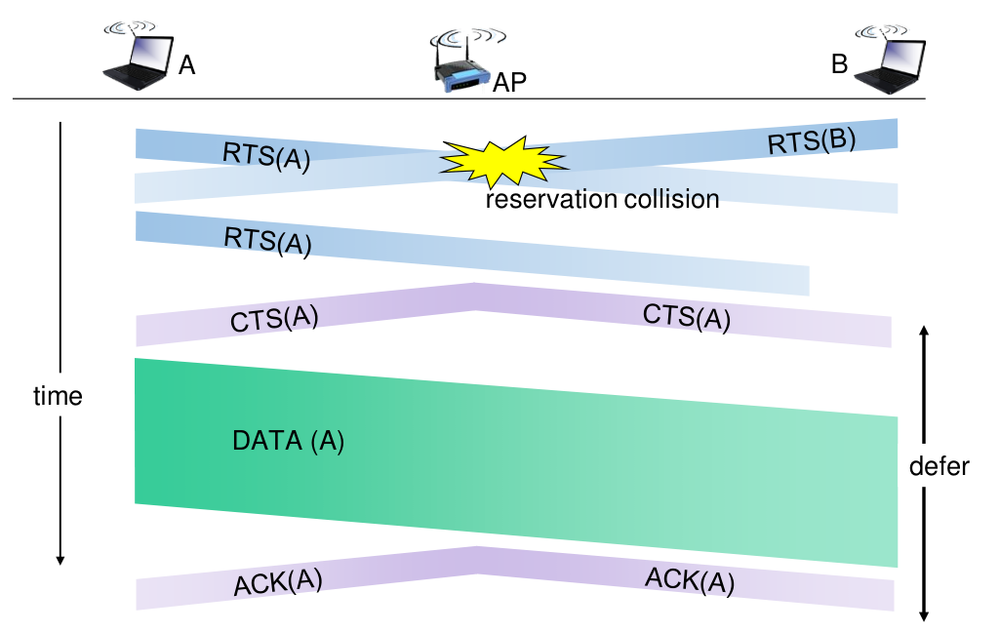

